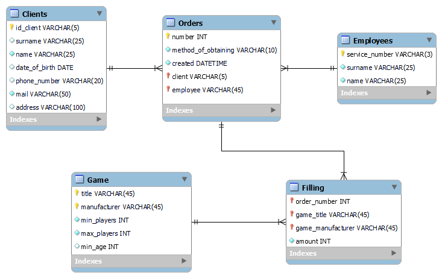

# __Лабораторная работа 7__

## __Реализация модели в Workbench (магазин настольных игр)__

_Автор работы: Стецук Максим 2гр.1п.гр._

Из описания предметной области получил дополнительную информацию, которая должна/может быть представлена в сущностях, поэтому прежде чем реализовывать схему в MySQL Workbench, дополнил сущность "_Заказ_" двумя атрибутами (_Клиент_, _Сотрудник_), а также выделил отдельную сущность, содержащую сведения о количестве экземпляров каждой из игр в конкретном заказе - "Наполнение".

## Начальные отношения:
### В таблицах помечены:
- атрибуты сущностей с значением NOT NULL;
- атрибуты являющиеся ключами - PK и атрибуты являющиеся внешними ключами - FK.

### Игра  
|Название   |Производитель|Мин игроков|Макс игроков|Мин возраст|
|:---------:|:-----------:|:---------:|:----------:|:---------:|
|PK NOT NULL|PK NOT NULL  |NOT NULL   |NOT NULL    |           |

### Клиент
|Ид_клиента    |Фамилия|Имя     |Дата рождения|Телефон|Почта   |Адрес|
|:------------:|:-----:|:------:|:-----------:|:-----:|:------:|:---:|
|PK NOT NULL UQ|       |NOT NULL|             |       |NOT NULL|     |

### Сотрудник
|Таб. Номер    |Фамилия |Имя     |
|:------------:|:------:|:------:|
|PK NOT NULL UQ|NOT NULL|NOT NULL|

### Заказ
|Номер            |Получение заказа|Создан  |_Клиент_ (FK)|_Сотрудник_ (FK)|
|:---------------:|:--------------:|:------:|:-----------:|:--------------:|
|PK NOT NULL UQ AI|NOT NULL        |NOT NULL|NOT NULL     |NOT NULL        |

### Наполнение
|_Номер Заказа_ (FK)|_Название игры_ (FK)|_Производитель_ (FK)|Количество|
|:-----------------:|:------------------:|:------------------:|:--------:|
|PK NOT NULL        |NOT NULL            |NOT NULL            |NOT NULL  |

## Реализация в Workbench

EER-диаграмма:  
  
Запрос создания находится в файле: [create_req.sql](create_req.sql)  
Запрос наполнения находится в файле: [insert_req.sql](insert_req.sql)

## Условия проверки атрибутов (названия атрибутов взяты из диаграммы):
#### Сущность "_Clients_":
- id_client LIKE 'K%'
- mail LIKE '%@%.%'
- phone_number LIKE '+7%' OR phone_number LIKE '8%'

#### Сущность "_Employees_":
- service_number LIKE 'C__'

#### Сущность "_Game_":
- min_players >= 1

#### Сущность "_Orders_":
- method_of_obtaining = 'Самовывоз' OR method_of_obtaining = 'Доставка'
- client LIKE 'K%'
- employee LIKE 'C__'

#### Сущность "_Filling_":
- amount >= 1

## Определение связей

- один клиент может сделать любое количество заказов (связь: Clients -> Orders);
- один сотрудник может вести несколько заказов (связь: Employees -> Orders);
- каждый заказ может содержать в себе несколько позиций (связь: Orders -> Filling);
- каждая игра может являться позицией многих заказов (связь: Game -> Filling).

## Вопрос
Допустим, что каждый сотрудник может обработать только один заказ (после
чего его увольняют). В этом случае, связь между отношениями ЗАКАЗ и
СОТРУДНИК трансформируется в один-к-одному. Что нужно будет сделать
дополнительно для поддержки этой связи? Что может помешать указать
одного и того же сотрудника в отношении ЗАКАЗ, ответственным за
обработку нескольких разных заказов?

Ответ: Для этого необходимо атрибут "_employee_" (_Сотрудник_) сущности "_Orders_" (_Заказ_) пометить как __UQ__ (__Unique index__). С данной пометкой при попытке сделать 2 записи с одинаковым значением _employee_ будет возникать ошибка о повторе значений.
