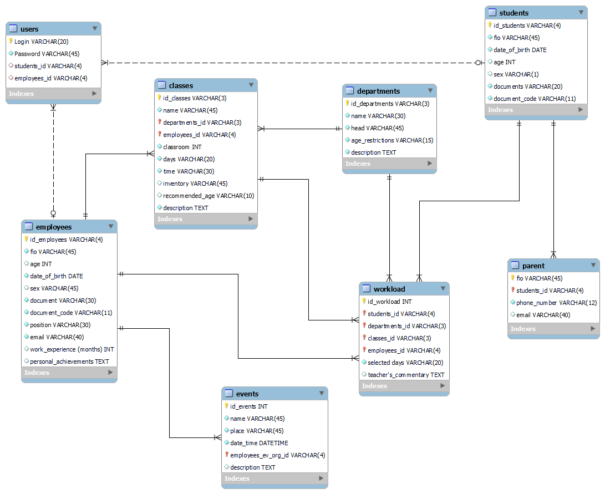

# Проект по дисциплине "Базы данных"
## Тема: База данных многопрофильной образовательной организации
### Авторы проекта: Стецук Максим, Каргаполов Денис студенты 2гр.1п.гр.

## Предметная область
-  Наша образовательная организация является творческим многопрофильным учреждением дополнительного образования детей. Все возможные занятия развивают знания учеников в определённом направлении. А также они делятся по направлениям, ориентированным на развитие навыков в одной определённой области знаний.  
-  За каждым направлением закреплён куратор, который способствует организации деятельности по различным дисциплинам данного направления. Каждую дисциплину ведёт высококвалифицированный специалист.  
-  Ученик волен выбирать направления и дисциплины на своё усмотрение, тем самым составляя свою рабочую нагрузку:)

  __*Наше учебное заведение также организует различные мероприятия для учеников. Со временем их будет становиться только больше!*__

## Организация ведения учёта процесса обучения
Для контроля над образовательным процессом и ведения ведомости наша образовательная организация использует самостоятельно разработанную базу данных.

Основная информация, хранимая нашей организацией:
- Информация о наших учениках;
- Информация о родителях или опекунах наших учеников (данная информация имеет важное значение, нам всегда необходмо оставаться на связи, в случае отсутствия ученика на занятиях или возникновения чрезвычайных ситуаций);
- Информация о наших преподавателях (наша организация располагает всей необходмой информацией, которуая демонстрирует квалифицированность и качества образования, предоставляемого нашими преподавателями);
- Информация о направлениях подготовки (для удобства выбора желаемого направления обучения, мы предоставляем краткое описание, информацию о кураторе и рекомендуемый возраст);
- Информация о дисциплинах, проводимых в составе направления (для полного отображения узкой направленности выбранной дисциплины, мы предоставляем такие сведения как описание, используемое оборудование, а также, для удобства выбора, указываем время и дни занятий);
- Информация о нагрузке ученика (совокупность необходимых, уже использованных данных, для более удобного отображения нагрузки ученика по каждому направлению и дисциплине с указанным количеством часов и дней)
- Информация о проведении внеурочных мероприятий различного масштаба и характера (Мы заранее предоставляем данную информацию нашим ученикам, чтобы они могли позвать родителей или согласовать с ними своё посещение).

__*Наша учебная организация также имеет онлайн портал на котором публикуется различная информация о мероприятиях, направлениях подготовки и многом другом. Любой может создать собственный аккаунт на нашем портале и ознакомиться с этой информацией, однако для наших учеников и преподавателей мы предоставляем возможность указания своего персонального идентификатора при регистрации, чтобы получить доступ к информации о предстоящих датах занятий, результатах обучения и многом другом (создание аккаунта является необязательным, а также на каждый персональный идентификатор может быть зарегистрирован только один аккаунт).*__

## Модель использовавшаяся при разработке базы данных
В данных условиях мы используем реляционную модель базы данных по причине необходимости взаимосвязи определённых сущностей с другими сущностями путём создания главных и внешних ключей на основе атрибутов сущностей. Для сохранения целостности базы данных необходимо наличие связей между сущностями (так как записи в определённых сущностях напрямую зависят от записей в других сущностях).

Разработанная база данных имеет 8 сущностей, каждая из которых содержит в себе некоторое количество атрибутов, т.к. реляционная модель позволяет это сделать. Однако если бы мы выбрали нереляционную модель, то (т.к. отсутствует привычная для реляционных баз данных схема из строк и столбцов, а используется схема состоящая из пар ключ:значение) количество сущностей бы значительно возрасло.  
Каждый NOT NULL атрибут (за исключением атрибутов id) стал бы отдельной сущностью, и общее их количество было бы не менее 27 (в случае представления в виде графа). Нереляционная модель удобна для хранения больших объёмов однотипной информации, однако в нашем случае информация является разноплановой, в связи с чем необходимо иметь гибкую структуру, простоту извлечения/изменения даннных, а также иметь возможность простого обращения к этим данным. Именно поэтому для разработки базы данных использовалась реляционная модель.

__База данных была разработана нами самостоятельно, в связи с чем использовалась изученная нами СУБД: "MySQL".__  
Причины выбора данной СУБД:
- Низкий порог входа для начала разработки;
- Доступный функционал;
- Возможность создания и представления как графическим методом, так и методом команд;
- Возможность работы с БД с помощью запросов на языке SQL.

## Разработанная база данных
Запрос создания базы данных представлен в файле: [_create_req.sql_](/create_req.sql)  
Запросы для ввода данных представлены в файле: [_input_data_req.sql_](/input_data_req.sql)  
Схема базы данных:  


## Объяснение основных моментов базы данных
1. Для сущностей: _students_, _employees_, _departments_, _classes_ - мы задали уникальное именование атрибутов id, для более удобного ориентирования и упрощения ведения таблицы загрузки учеников (_workload_).

Объяснение идентификаторов:  
Знак '_' - означает наличие некоторый цифры на его месте.  
- Сущность __students__: идентификатор _id_students_ имеет вид: "S___"
- Сущность __employees__: идентификатор _id_employees_ имеет вид: "E___"
- Сущность __departments__: идентификатор _id_departments_ имеет вид: "D__"
- Сущность __classes__: идентификатор _id_classes_ имеет вид: "C__"

__Задание id с параметром AUTO_INCREMENT существенно осложняло работу с созданной базой данных, т.к. тогда при заполнении информации в зависимых сущностях (особенно сущности Workload) могла возникнуть проблема для идентификации сущности, из которой взято соответствующее значение.__  
__Также для сущностей *students* и *employees* необходимо использование уникальных идентификаторов, без AUTO_INCREMENT в связи с их использованием при регистрации на онлайн ресурсе. Т.к. связь *students*,*employees* -> *users* является связью 1:1, то при появлении одинаковых идентификаторов в *students* и *employees* возникнет ошибка при их использовании в *users* (т.к. на один уникальный идентификатор может быть зарегистрирован только один аккаунт).__ 

2. Все связи между сущностями в разработанной базе данных являются _идентифицирующими_, кроме связей с сущностью __users__. Аргументацией такого выбора является зависимость одних сущностей от других и не возможность существования записей в зависимых сущностях без указания конкретных записей из главной(ых) сущности(ей), кроме сущности __users__.

Аргументация для каждой связи:
- __students__ -> __parent__: В таблице parent не может существовать записи без указания конкретного ученика;
- __employees__ -> __events__: Не может существовать запись о некотором событии, без указания ответственного преподавателя (наблюдающего);
- __departments__, __employees__ -> __classes__: Запись про каждую дисциплину должна содержать информацию о том, к какому направению она относится и какой преподаватель её ведёт (дисциплина не может быть добавлена без указания этих данных);
- __students__, __employees__, __departments__, __classes__ -> __workload__: Каждая запись содержит в себе идентификаторы перечисленных сущностей, так как каждая запись в сущности *workload* не может быть добавлена без студента и без дисциплины, которая в свою очередь не может существовать без преподавателя и направления;
- __students__, __employees__ -> __users__: т.к. аккаунт может создать любой пользователь портала, то запись в __users__ может существовать без указания некоторой записи из сущностей __students__ и __employees__, а значит быть независимой, поэтому связь является неидентифицирующей.

3. Мощности связей:
- __students__ -> __parent__: Для каждого ученика может быть указано нексколько родителей/опекунов (т.к. данная информация необходима для связи в случае возникновения непредвиденных обстоятельств, могут быть указаны также бабушки/дедушки), поэтому связь 1:n;
- __employees__ -> __events__: Каждый преподаватель может являться организатором для нескольких мероприятий (и единственным), поэтому связь 1:n;
- __departments__ -> __classes__: Каждое направление может содержать несколько дисциплин, но дисциплина не может относиться к нескольким направлениям, поэтому связь 1:n;
- __employees__ -> __classes__: Каждую дисциплину ведёт только один определённый преподаватель и каждый преподаватель может вести несколько дисциплин, поэтому связь 1:n;
- __students__ -> __workload__: Каждый ученик может заниматься несколькими дисциплинами, а значит несколько раз быть указаным в таблице с нагрузкой, поэтому связь 1:n;
- __employees__ -> __workload__: Преподаватель ведёт у групп учеников, поэтому может встречаться в таблице с нагрузкой несколько раз, поэтому связь 1:n;
- __departments__ -> __workload__: Каждое направление может встречаться в таблице нагрузки учеников несколько раз (относится к ученикам), поэтому связь 1:n;
- __classes__ -> __workload__: Каждая дисциплина может встречаться в таблице нагрузки учеников несколько раз (разные ученики могли выбрать одну дисциплину), поэтому связь 1:n;
- __students__ -> __users__: На каждый персональный идентификатор ученика может быть зарегистрирован ровно один аккаунт, поэтому связь 1:1;
- __employees__ -> __users__: На каждый персональный идентификатор преподавателя может быть зарегистрирован ровно один аккаунт, поэтому связь 1:1;

4. Реализована проверка возраста для учеников, а также добавлено ограничение на длину пароля (не менее 8 символов) с помощью __*CHECK*__  
Возраст (родился не позднее 2017 года => возраст хотя бы 6 лет):
```SQL
`date_of_birth` DATE NOT NULL CHECK (YEAR(`date_of_birth`) <= 2017),
```
Пароль (не менее 8 символов):
```
`Password` VARCHAR(45) NOT NULL CHECK (`Password` LIKE '________%'),
```