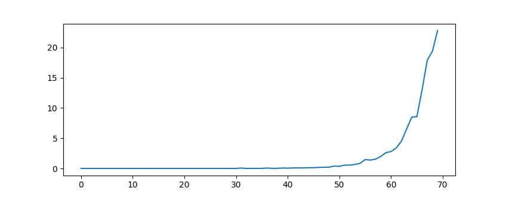
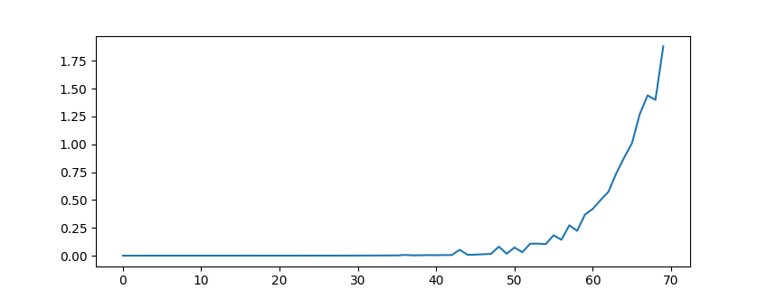

# __Лабораторная работа 3__

## __Сравнение времени выполнения рекурсивного и не рекурсивного алгоритмов для построения бинарного дерева__

_Автор работы: Стецук Максим 2гр.1п.гр._

Сравнение эффективности работы(с точки зрения времени) рекурсивного и не рекурсивного вариантов алгоритма для построения бинарного дерева.

##  Время вычисления функции построения бинарного дерева 

Оценим время построения бинарного дерева (_рекурсивный_ и _нерекурсивный_) со следующими параметрами:

### Измерение №1

height=8, root=11, left_l_func=lambda r: r**2, right_l_func=lambda r: 2 + r**2  
n = 100 (количество повторений за один круг)

* Для алгоритма с рекурсией(запуск через Shell):

python -m timeit -n 100 -u sec 'from bin_tree_rec import gen_bin_tree' 'gen_bin_tree(height=8, root=11, left_l_func=lambda r: r**2, right_l_func=lambda r: 2 + r**2)'

_Результат: 100 loops, best of 5: 0.00401 sec per loop_

* Для алгоритма без рекурсии(запуск через Shell):

python -m timeit -n 100 -u sec 'from bin_tree_no_rec import gen_bin_tree_No_rec' 'gen_bin_tree_No_rec(height=8, root=11, left_l_func=lambda r: r**2, right_l_func=lambda r: 2 + r**2)'

_Результат: 100 loops, best of 5: 0.00102 sec per loop_

### Измерение №2

height=10, root=11, left_l_func=lambda r: r**2, right_l_func=lambda r: 2 + r**2  
n = 100 (количество повторений за один круг)

* Для алгоритма с рекурсией(запуск через Shell):

python -m timeit -n 100 -u sec 'from bin_tree_rec import gen_bin_tree' 'gen_bin_tree(height=10, root=11, left_l_func=lambda r: r**2, right_l_func=lambda r: 2 + r**2)'

_Результат: 100 loops, best of 5: 0.0817 sec per loop_

* Для алгоритма без рекурсии(запуск через Shell):

python -m timeit -n 100 -u sec 'from bin_tree_no_rec import gen_bin_tree_No_rec' 'gen_bin_tree_No_rec(height=10, root=11, left_l_func=lambda r: r**2, right_l_func=lambda r: 2 + r**2)'

_Результат: 100 loops, best of 5: 0.0111 sec per loop_

### Измерение №3

height=11, root=11, left_l_func=lambda r: r**2, right_l_func=lambda r: 2 + r**2  
n = 100 (количество повторений за один круг)

* Для алгоритма с рекурсией(запуск через Shell):

python -m timeit -n 100 -u sec 'from bin_tree_rec import gen_bin_tree' 'gen_bin_tree(height=11, root=11, left_l_func=lambda r: r**2, right_l_func=lambda r: 2 + r**2)'

_Результат: 100 loops, best of 5: 0.515 sec per loop_

* Для алгоритма без рекурсии(запуск через Shell):

python -m timeit -n 100 -u sec 'from bin_tree_no_rec import gen_bin_tree_No_rec' 'gen_bin_tree_No_rec(height=11, root=11, left_l_func=lambda r: r**2, right_l_func=lambda r: 2 + r**2)'

_Результат: 100 loops, best of 5: 0.0626 sec per loop_

*Для запуска timeit можно также использовать команду: _python timeit_prof.py_  
(Параметры в данном случае меняются непосредственно в файле __timeit_prof.py__)

_Результаты для следующих параметров:_height=10, root=11, left_l_func=lambda r: r**2, right_l_func=lambda r: 2 + r**2, number of repetitions = 100;  
С рекурсией:  7.724757187999785  
Без рекурсии:  1.275882072000968

## Графики зависимости загрчиваемого времени, в зависимости от параметров height и root

Параметры для вычислений задаются с помощью функции _setup_data_, которая получает на вход целое число и создаёт фиксированные пары чисел для обоих вариантов алгоритма построения дерева.  
(Используются иные функции для создания листьев дерева чтобы обработать большее число вариантов и избежать ошибки с лимитом преобразования строковых значений к целым числам для рекурсивного варианта: lambda r: r + 3, lambda r: r * 2)

### Вариант с рекурсией 

### Вариант без рекурсии 

В обоих случаях:  
* Горизонтальный столбец - номер пары входных значений
* Вертикальный столбец - время выполнения

## Вывод  
Исходя из проведённых вычислений времени видим, что с увеличением входных значений в обоих случаях время выполнения возрастает, однако алгоритм с рекурсией значительно медленнее алгоритма без неё, при малых объёиах вычислений разница невелика, однако как видно из приведённых графиков, при больших входных данных, алгоритм без рекурсии более чем в 10 раз быстрее алгоритма с рекурсией.