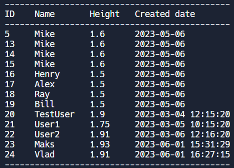

# __Лабораторная работа 8__

## __Работа с БД с использованием ORM Orator__

_Автор работы: Стецук Максим 2гр.1п.гр._

В файле __*user_class_construct.py*__ реализован класс-конструктор __Users_construct__, который импортируется в файл __*main.py*__ и вызывается для создания пользователей, которые затем добавляются в базу данных. Данный класс, при создании объекта проводит проверку данных на валидность:
- name начинается с буквы;
- height хотя бы 1;
- created введено в формате: "YYYY-MM-DD HH:MM:SS".

В файле __*main.py*__ реализован класс __User__ который реализует работу с БД с использованием Orator. В качестве методов класса реализованы операции CRUD (в нескольких вариациях):

### Create:
- *create_user*  
Получает на вход некоторое количество объектов класса *Users_construct*, а затем добавляет их данные в БД.  
#### Вызов:
```python
User.create_user(user1, user2, ...)
```

### Read:
- *select_all*  
Выводит все записи из БД в отформатированном виде:  

#### Вызов:
```python
User.select_all()
```
- *select_by_id*  
Получает на вход некоторое количество значений id и выводит записи с полученными id.  
#### Вызов:
```python
User.select_by_id(id_1, id_2, id_3, ...)
```
- *select_by_name*  
Получает на вход значение "option" (знак сравнения '=' или '<>') и name и выводит все записи с данным именем или все записи кроме записей с данным именем в зависимости от введённого знака.  
#### Вызов:
```python
User.select_by_name(option, name)
```
- *select_by_height*  
Получает на вход значение "option" (знак сравнения '=','<>','<','>') и "height" и выводит все записи, для которых выполняется условие проверки: _User.height 'option' 'height'_ (например: User.height > 1.6).
#### Вызов:
```python
User.select_by_height(option, height)
```

### Update
- *update_by_id*  
Получает на вход id, name, height. Находит запись по полученному id и заменяет значения name и height на полученные (если при вызове для name или height были указаны значения __None__, то соответствующие данные в найденной записи не будут изменены).
#### Вызов:
```python
User.update_by_id(id, name, height)
```
- *update_by_name*  
Получает на вход option (знак сравнения '=' или '<>'), name, name_new, height. С помощью option и name (используя метод класса User *where*), получает все записи с именем name или наоборот все записи кроме записей с именем name, а затем заменяет значения User.name и User.height на полученные значения name_new и height соответственно (если какое-либо из этих полученных значений = None, то не заменяет!).
#### Вызов
```python
User.update_by_name(option, name, name_new, height)
```

### Delete
- *delete_by_id*  
Получает на вход некоторое количество значений id, а затем удаляет записи с id равными полученным id.
#### Вызов
```python
User.delete_by_id(id_1, id_2, id_3, ...)
```
- *delete_by_names*  
Получает на вход option (знак сравнения '=' или '<>') и некоторое количество имён (name_1, name_2, ...), а затем, в зависимости от option, либо удаляет все записи с введёнными именами, либо удаляет все записи, кроме записей с введёнными именами.
#### Вызов
```python
User.delete_by_names(option, name_1, name_2, name_3, ...)
```
