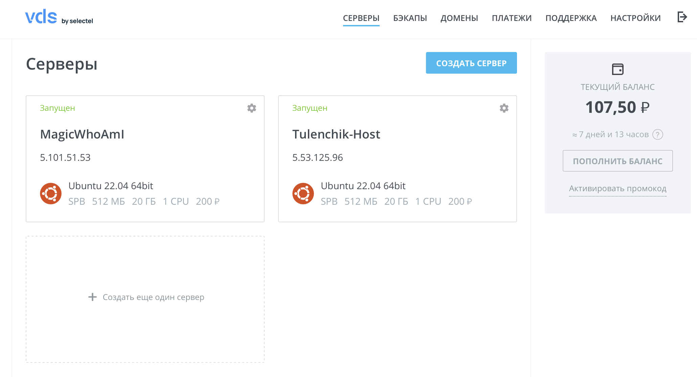
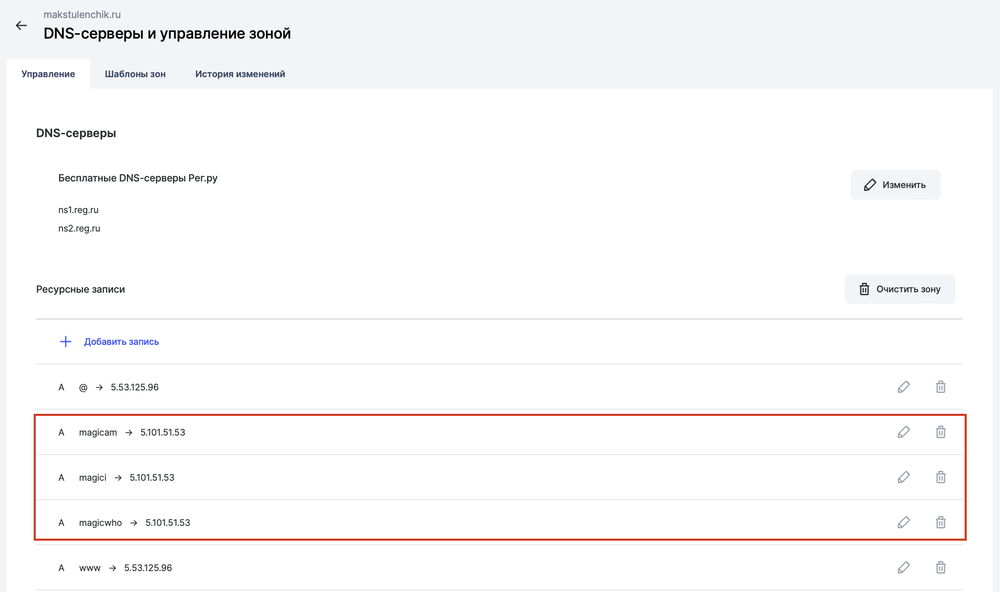
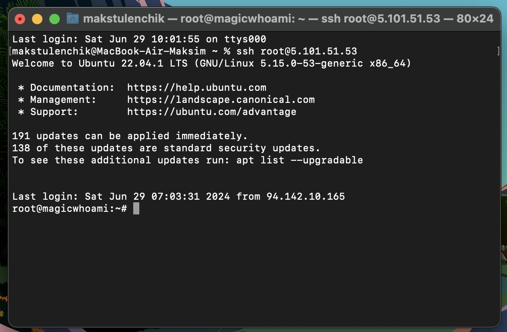
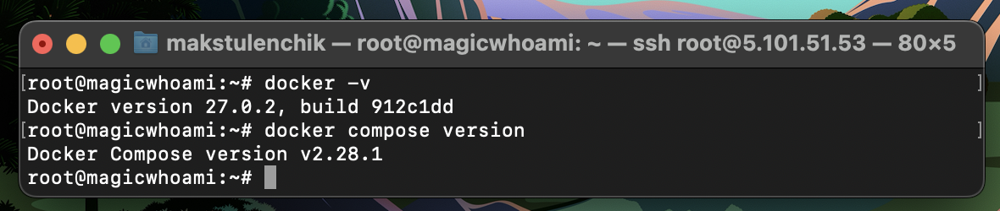
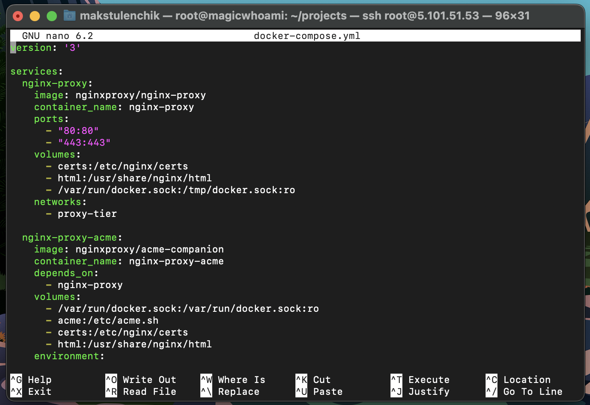
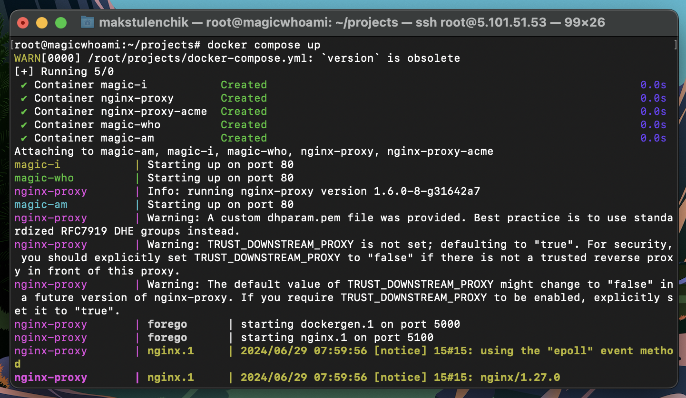
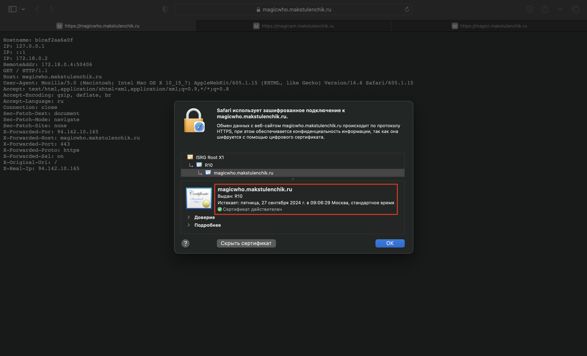
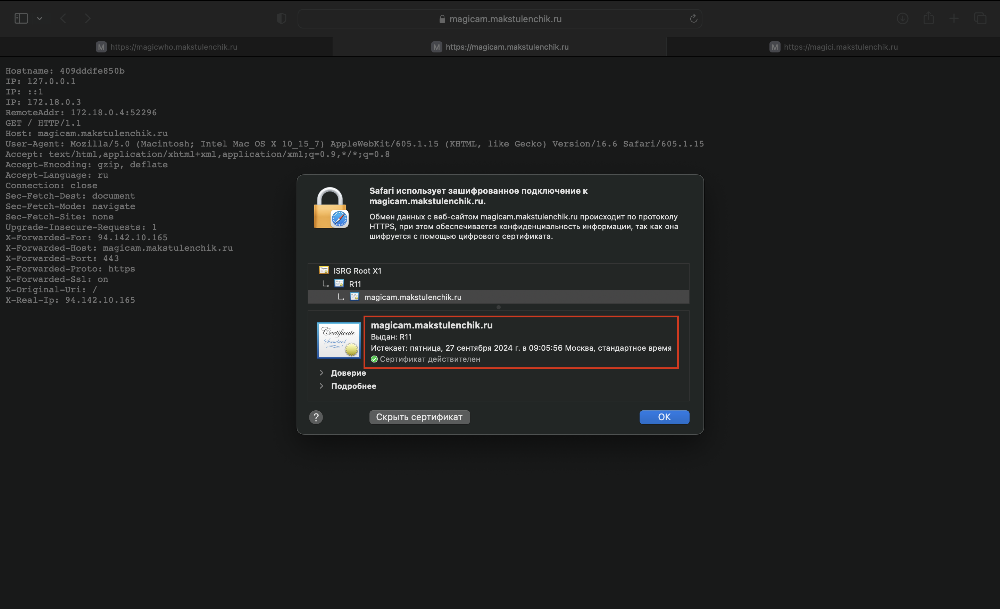
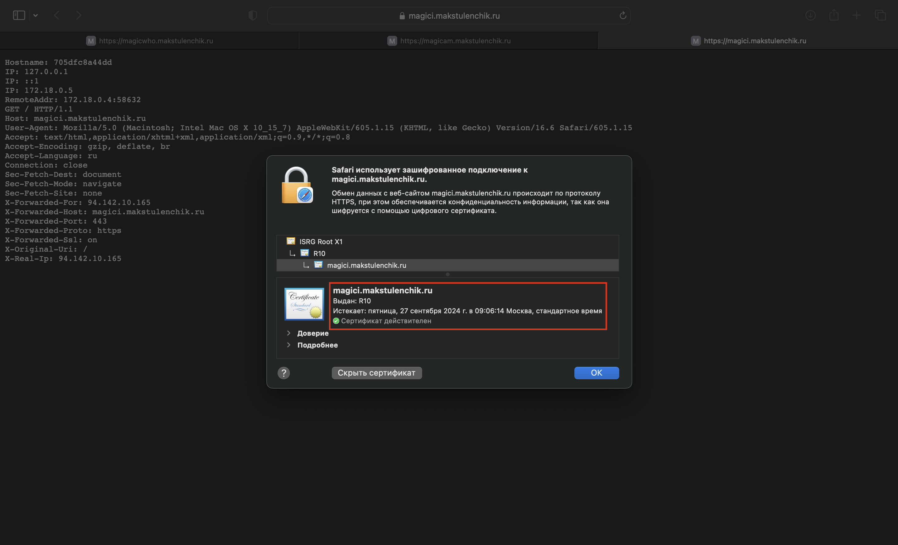

#### _Автор: Стецук Максим 1гр.2п.гр._

## Развертывание комбинации из Nginx Proxy & Let'sEncrypt компаньона для нескольких приложений

1. Создаем сервер (или берем существующий), в моем случае я создал новый на VDS (новый сервер - MagicWhoAmI, ip:5.101.51.53).



2. После создания сервера настраиваем поддомены. В данном случае я настроил 3 поддомена: magicwho, magicam и magici (для них указал ip ранее созданного сервера).



3. Подключаемся к серверу:



4. Устанавливаем Docker и Docker Compose на сервере (команды взяты из официальной документации Docker):

Set up Docker's `apt` repository:
```console
sudo apt-get update
sudo apt-get install ca-certificates curl
sudo install -m 0755 -d /etc/apt/keyrings
sudo curl -fsSL https://download.docker.com/linux/ubuntu/gpg -o /etc/apt/keyrings/docker.asc
sudo chmod a+r /etc/apt/keyrings/docker.asc

echo \
  "deb [arch=$(dpkg --print-architecture) signed-by=/etc/apt/keyrings/docker.asc] https://download.docker.com/linux/ubuntu \
  $(. /etc/os-release && echo "$VERSION_CODENAME") stable" | \
  sudo tee /etc/apt/sources.list.d/docker.list > /dev/null
sudo apt-get update
```

Install the Docker packages:
```console
sudo apt-get install docker-ce docker-ce-cli containerd.io docker-buildx-plugin docker-compose-plugin
```

Install the Docker-Compose
```console
sudo apt-get update
sudo apt-get install docker-compose-plugin
```

Docker и Docker Compose установлены:



5. Создаем директорию в которой разместим _docker-compose.yml_ (в моем случае это директория _projects_), после чего создаем сам файл:

```console
mkdir projects
cd projects
touch docker-compose.yml
```

После создания файла открываем его и вставляем код из созданного yml файла (мой __*docker-compose.yml*__ представлен в данном репозитории):

```console
nano docker-compose.yml
```



6. Сохраняем изменения в файле и запускаем Docker Compose:

```console
docker compose up
```



7. Ожидаем конца создания и запуска контейнеров, после чего можем убедиться в получении SSL сертификатов для настроенных и указанных в _docker-compose.yml_ поддоменов (в моем случае это 3 адреса: _magicwho.makstulenchik.ru_, _magicam.makstulenchik.ru_, _magici.makstulenchik.ru_):

- Сертификат для _magicwho.makstulenchik.ru_:  


- Сертификат для _magicam.makstulenchik.ru_:  


- Сертификат для _magici.makstulenchik.ru_:  


---

### Ссылки

- [docker-compose.yml](docker-compose.yml)

- [Скринкаст с демонстрацией развертывания](https://disk.yandex.ru/i/ezMuCvPyc2fZ-Q)
