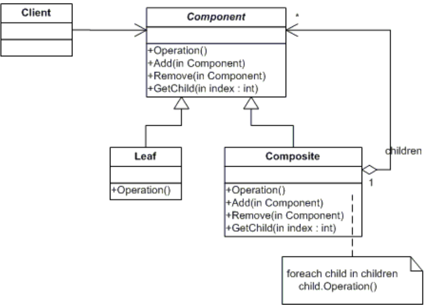
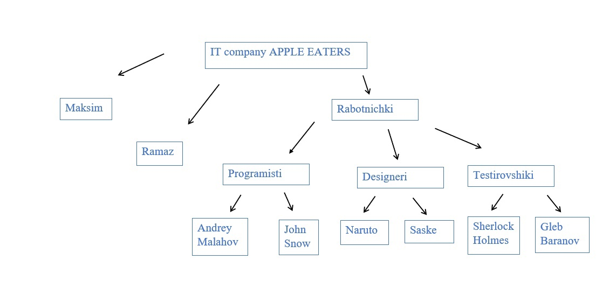

## Composite pattern (Компоновщик)  
__Авторы:__ Стецук Максим, Сафин Рамаз  

### Основные сведения
*Паттерн Компоновщик (Composite pattern)* - это структурный паттерн проектирования, который позволяет сгруппировать объекты в древовидные структуры для представления часть-целое (part-whole) и обрабатывать индивидуальные объекты и композиции объектов одинаковым образом.

__*Идея в виде схемы:*__  


__Главные аспекты:__
1. Объединение объектов:
    - Позволяет обращаться к отдельным объектам и их композициям (группам объектов) одинаковым образом;
2. Структура дерева:
    - Объекты объединяются в древовидные структуры;
3. Единообразный доступ:
    - Взаимодействие с различными объектами выполняется в едином стиле.

### Общая схема паттерна "Компоновщик"  
``` Python
class Component():
    def operation(self):
        pass

# Конкретный элемент
class Leaf(Component):
    def operation(self):
        pass

# Группа элементов и подгрупп
class Composite(Component):
    def __init__(self):
        self.children = []

    def add(self, component):
        self.children.append(component)

    def remove(self, component):
        self.children.remove(component)

    def operation(self):
        # Реализация операции для группы
        for child in self.children:
            child.operation()
```

### Пример реализации
Реализацию паттерна рассмотрим на примере создания и организации структуры некоторой организации.

__Код:__  
``` Python
class OrgStructure:
  def __init__(self, name):
      self.name = name

  def show_info(self, indent=""):
      pass

class Employee(OrgStructure):
  def __init__(self, name, position):
      super().__init__(name)
      self.position = position

  def show_info(self, indent=""):
      print(f"{indent}{self.position}: {self.name}")

class Department(OrgStructure):
  def __init__(self, name):
      super().__init__(name)
      self.structure = []

  def add_employee(self, employee):
      self.structure.append(employee)

  def remove_employee(self, employee):
      self.structure.remove(employee)

  def add_department(self, department):
      self.structure.append(department)

  def remove_department(self, department):
      self.structure.remove(department)

  def show_info(self, indent=""):
      print(f"{indent}Department: {self.name}")
      for elem in self.structure:
          elem.show_info(indent + "   ")
```

- *class OrgStructure*: это базовый класс, который содержит атрибуты и методы,которые будут доступны для каждого объекта дочерних классов. В нашем случае это атрибут _name_ и метод _show_info_;
- *class Employee(OrgStructure)*: наследуется от класса OrgStructure, является конструктором для добавления отдельных работников и содержит метод _show_info_, который выводит имя и должность работника;
- *class Department(OrgStructure)*: наследуется от класса OrgStructure, является конструктором для добавления новых отделов (групп из работников и отделов), содержит такие методы, как:
  - *add_employee*: добаляет в группу нового работника;
  - *remove_employee*: убирает работника из группы;
  - *add_department*: добавляет группу в качестве подгруппы для группы, к которой применяется метод;
  - *remove_department*: удаляет подгруппу из группы.

### Пример структуры:
