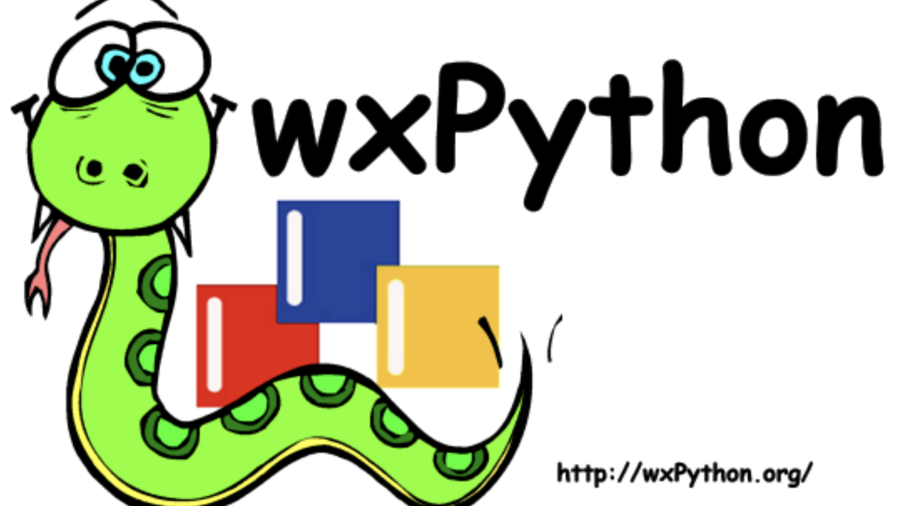
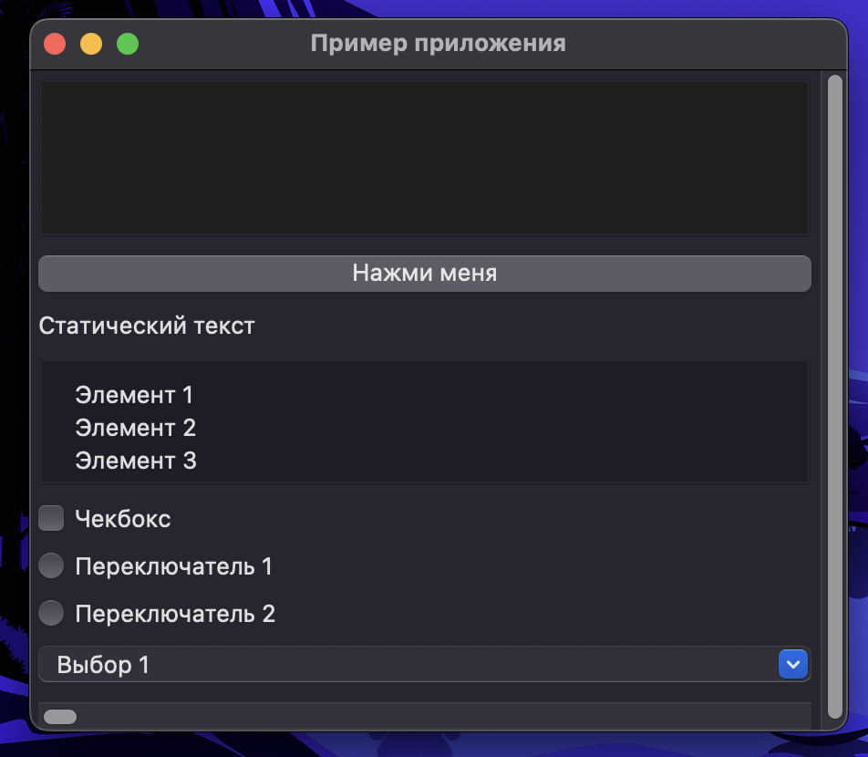

# WxWidgets / WxPython
### _Авторы: Стецук Максим, Каргаполов Денис_

## _WxWidgets_  

__WxWidgets__ — это кроссплатформенная библиотека для создания графического пользовательского интерфейса

__*WxWidgets была разработана в 1992 году, поддерживая работу, как на Windows, так и на рабочих станциях Unix на базе X. Отсюда и взялась приписка wx (w - windows, x - unix на базе X)*__  

### Особенности:
- Кроссплатформенность (обеспечивает работу на различных операционных системах, включая Windows, macOS и Linux);
- Обширный набор компонентов интерфейса;
- Адаптация под различные языки программирования;
- Гибкость и расширяемость (модульность разрабатываемых GUI);

### Под какие языки адаптирована?
- __C++__: основная библиотека WxWidgets;
- __Python__: библиотека под названием wxPython;
- __Perl__: библиотека под названием WxPerl;
- __Ruby__: библиотека под названием wxRuby.

___


## _WxPython_  


__wxPython__ - это привязка библиотеки WxWidgets к языку программирования Python. 

_wxPython была разработана в начале 2000-х годов. Её первая версия (wxPython 2.0) была выпущена в 2002 году._

## _Первый запуск_
Программа, отображающая Hello World в названии окна:
```python
import wx

app = wx.App(False)  # Создаёт новое приложение
frame = wx.Frame(None, wx.ID_ANY, "Hello World") #Frame  -- главное окно
frame.Show(True)     # Показывает frame
app.MainLoop()
```


### Значения строк
- _app = wx.App(False)_: Каждое приложение wxPython является экземпляром wx.App. Для большинства простых приложений вы можете использовать wx.App как есть. Когда вы перейдете к более сложным приложениям, вам может потребоваться расширить класс wx.App. Параметр "False" означает "не перенаправлять stdout и stderr в окно".
- _wx.Frame(None,wx.ID_ANY,"Hello")_: Wx.Frame - это окно верхнего уровня. Синтаксис wx.Frame (родительский объект, идентификатор, заголовок). Большинство конструкторов имеют такую форму (родительский объект, за которым следует идентификатор). В этом примере мы используем None для "no parent" и wx.ID_ANY, чтобы wxWidgets мог выбрать идентификатор для нас.
- _frame.Show(True)_: Мы делаем рамку видимой, "показывая" ее.
- _app.MainLoop()_: Наконец, мы запускаем основной цикл приложения, роль которого заключается в обработке событий.

## Виджеты (элементы) wxPython

__*Прежде чем переходить к рассмотрению виджетов, стоит отметить, что при реализации GUI на Python с помощью wxPython cледует использовать объектно-ориентированный подход к программированию.*__
Причины:
- _Модульность и повторное использование_: различные компоненты интерфейса могут быть реализованы в виде отдельных классов, что упрощает их создание и интеграцию в приложение;
- _Управление состоянием и событиями_: позволяют легко управлять состоянием объектов и обрабатывать события, такие как нажатия кнопок, ввод текста и другие пользовательские действия;
- _Расширяемость и поддержка наследования_: позволяет легко расширять функциональность wxPython путем создания подклассов с дополнительными методами и свойствами;
- _Согласованность стиля кода_: способствует согласованности стиля кода и улучшает его читаемость и поддерживаемость.

__*Основные виджеты, которые мы рассмотрим*__:
1. wx.Frame: Это основное окно приложения, которое содержит другие виджеты, такие как кнопки, текстовые поля и т. д.
2. wx.Panel: Панель используется для организации и группировки других виджетов. Она может использоваться внутри wx.Frame для разделения интерфейса на логические части.
3. wx.ScrolledWindow: Это виджет в библиотеке, который предоставляет прокручиваемую область, в которой можно размещать другие виджеты. 
4. wx.Button: Кнопка используется для создания интерактивных элементов, которые пользователь может нажимать для выполнения определенных действий, таких как сохранение данных или переход на другой экран.
5. wx.TextCtrl: Элемент управления текстом позволяет пользователю вводить и редактировать текст. Он может быть использован для ввода текста, вывода результатов или редактирования файлов.
6. wx.StaticText: Статический текст используется для отображения текста, который не может быть изменен пользователем. Он может использоваться для отображения инструкций, меток или другой статической информации.
7. wx.ListBox: Список используется для отображения списка элементов, из которых пользователь может выбирать один или несколько элементов. Это может быть полезно для выбора из предопределенных вариантов.
8. wx.CheckBox: Флажок используется для предоставления пользователю возможности выбора одного или нескольких вариантов из набора альтернатив. Каждый флажок может быть установлен или снят пользователем.
9. wx.RadioButton: Кнопка-переключатель также используется для предоставления пользователю выбора, но в отличие от флажка пользователь может выбрать только один из предоставленных вариантов.
10. wx.ComboBox: Комбинированный список позволяет пользователю выбирать один из предопределенных вариантов из выпадающего списка. Это удобно, когда есть много вариантов, но они не должны занимать много места на экране.
11. wx.ScrollBar:Виджет прокрутки, который обычно используется для прокрутки содержимого в окне или панели, если оно не помещается на экране. Это удобно, когда содержимое имеет большой объем, но нужно ограничить его отображение на экране. Виджет состоит из ползунка, который можно перемещать, и иногда из стрелок для пошаговой прокрутки.

### Синтаксис
- wx.Frame(parent, id, pos, size, style, name)
- wx.Panel(parent, id, pos, size, style, name)
- wx.ScrolledWindow(parent, id, pos, size, style, name)
- wx.Button(parent, id, pos, size, style, name)
- wx.TextCtrl(parent, id, pos, size, style, name)
- wx.StaticText(parent, id, pos, size, style, name)
- wx.ListBox(parent, id, pos, size, style, name)
- wx.CheckBox(parent, id, pos, size, style, name)
- wx.RadioButton(parent, id, pos, size, style, name)
- wx.ComboBox(parent, id, pos, size, style, name)
- wx.ScrollBar(parent, id, pos, size, style, name)


### Простой пример расположения виджетов на странице:

Код:
``` Python
import wx

class MyFrame(wx.Frame):
    def __init__(self, parent, title):
        super(MyFrame, self).__init__(parent, title=title, size=(400, 300))

        # Создаем область (ScrolledWindow)
        panel = wx.ScrolledWindow(self)
        panel.SetScrollbars(1, 1, 1, 1)

        # Создаем виджеты
        text_ctrl = wx.TextCtrl(panel, style=wx.TE_MULTILINE)
        button = wx.Button(panel, label="Нажми меня")
        static_text = wx.StaticText(panel, label="Статический текст")
        list_box = wx.ListBox(panel, choices=["Элемент 1", "Элемент 2", "Элемент 3"], style=wx.LB_SINGLE)
        check_box = wx.CheckBox(panel, label="Чекбокс")
        radio_btn1 = wx.RadioButton(panel, label="Переключатель 1", style=wx.RB_GROUP)
        radio_btn2 = wx.RadioButton(panel, label="Переключатель 2")
        combo_box = wx.ComboBox(panel, choices=["Выбор 1", "Выбор 2", "Выбор 3"], style=wx.CB_READONLY)
        scrollbar = wx.ScrollBar(panel, style=wx.HORIZONTAL)

        # Размещаем виджеты на панели
        vbox = wx.BoxSizer(wx.VERTICAL)
        vbox.Add(text_ctrl, proportion=0, flag=wx.EXPAND | wx.ALL, border=5)
        vbox.Add(button, proportion=0, flag=wx.EXPAND | wx.ALL, border=5)
        vbox.Add(static_text, proportion=0, flag=wx.EXPAND | wx.ALL, border=5)
        vbox.Add(list_box, proportion=0, flag=wx.EXPAND | wx.ALL, border=5)
        vbox.Add(check_box, proportion=0, flag=wx.EXPAND | wx.ALL, border=5)
        vbox.Add(radio_btn1, proportion=0, flag=wx.EXPAND | wx.ALL, border=5)
        vbox.Add(radio_btn2, proportion=0, flag=wx.EXPAND | wx.ALL, border=5)
        vbox.Add(combo_box, proportion=0, flag=wx.EXPAND | wx.ALL, border=5)
        vbox.Add(scrollbar, proportion=0, flag=wx.EXPAND | wx.ALL, border=5)

        panel.SetSizer(vbox)

if __name__ == '__main__':
    app = wx.App()
    frame = MyFrame(None, "Пример приложения")
    frame.Show()
    app.MainLoop()
```

GUI:  


## Разработанная программа (интерфейс к получению данных о погоде)

В файле _main.py_ представлен реализованный пример программы с графическим инфтерфейсом для получения данных о погоде.

## _Источники_:
1. [WxPython - краткий курс обучения](http://larionov.mytomsk.ru/translate/wx.pdf)
2. [wxPython: Базовые виджеты](https://proproprogs.ru/wxpython/bazovye-vidzhety-wxpython)
3. [Курс уроков по wxPython](https://python-scripts.com/wxpython)

