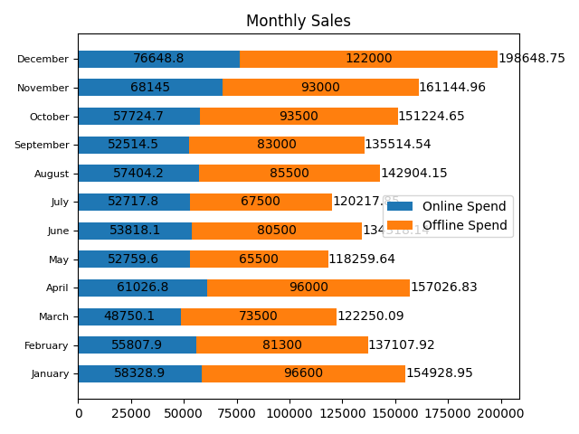
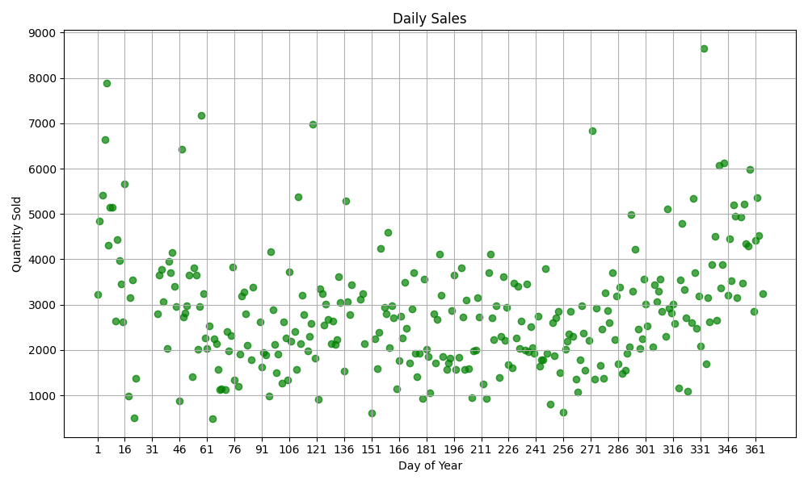

# Лабораторная работа 1-2

### __Автор:__ Стецук Максим ИВТ 3 курс

## Часть 1

### MathStats (реализованные методы)

В файле _mathstats.py_ реализован класс _MathStats_ в котором реализованы методы для нахождения среднего значения, максимума, минимума, дисперсии и среднего квадратического отклонения для параметров Offline Spend, Online Spend.

__Реализованные методы класса:__
- _data_ (Получает данные из файла MarketingSpend.csv);
- _mean_ (Находит средние значения для параметров Offline Spend, Online Spend);
- _max_ (Находит максимумы для параметров Offline Spend, Online Spend);
- _min_ (Находит минимумы для параметров Offline Spend, Online Spend);
- _disp_ (Находит дисперсию для параметров Offline Spend, Online Spend);
- _sigma_sq_ (Находит среднее квадратическое отклонение для параметров Offline Spend, Online Spend).

### Проверка с помощью Pandas

Для проверки корректности работы реализованных методов, в файле _pandas_test.py_ была реализована функция _test_pandas_vals_, которая импортирует библиотеку __pandas__ и с помощью доаступных в ней методах производит аналогичные вычисления, что и методы реализованные в классе MathStats.

### Некоторые функции реализованные в main

- _count_invoice_ - выполняет подсчет различных инвойсов (поле InvoiceNo) через генератор;
- _count_different_values_ - подсчитывает количество различных значений в столбце по ключу (названию столбца: InvoiceNo, InvoiceDate или StockCode);
- _get_total_quantity_ - подсчитывает общее количество проданного товара для данного stock_code.

## Часть 2

В файле _sales_by_month_plot_builder.py_ реализована функция _sales_by_month_, которая на основе файла _MarketingSpend.csv_ рассчитывает суммарные Online и Offline продажи по месяцам, а затем строит график по полученным значениям (также на графике выводится суммарное значение Online + Offline). Изображение полученного графика сохраняется в каталог __*plots*__.

__*График "Sales_by_month":*__

---

В файле _sales_by_day_plot_builder.py_ реализована функция _sales_by_day_, которая на основе файла _Retail.csv_ рассчитывает суммарное количества проданных изделий (StockCode) за каждый день, а затем строит график рассеяния по полученным значениям. Изображение полученного графика сохраняется в каталог __*plots*__.

__*График "Sales_by_day":*__
