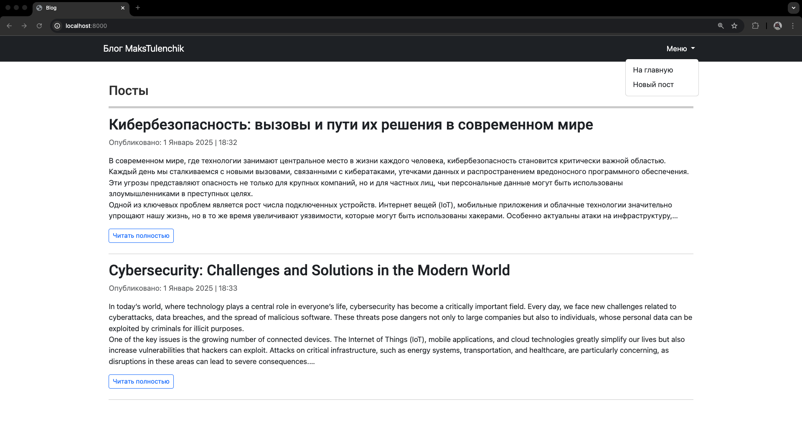
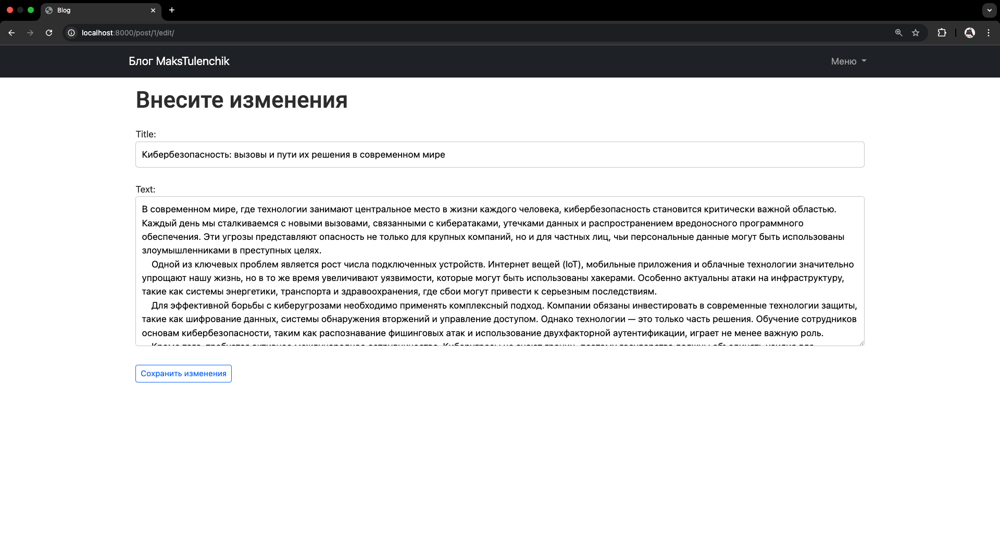
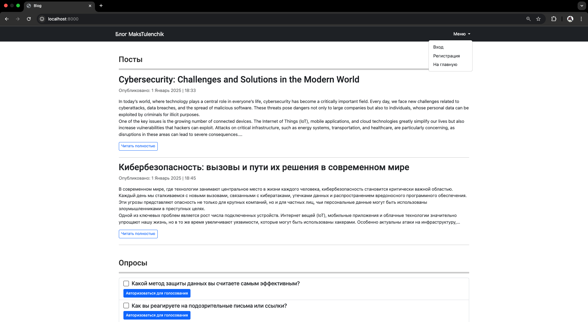

# Django

#### _Автор: Стецук Максим 1гр.2п.гр._

#### Выполненные задания:
- [Лабораторная работа 3 | "Введение в Django"](#лабораторная-работа-3--введение-в-django)
- [Лабораторная работа 4 | "Применение форм в Django"](#лабораторная-работа-4--применение-форм-в-django)
- [Практическая работа | "Настройка OAuth 2.0 авторизации в Django приложении"](#практическая-работа--настройка-oauth-20-авторизации-в-django-приложении)
- [Лабораторная работа 5 | "Django REST Framework"](#лабораторная-работа-5--django-rest-framework)

---

## Лабораторная работа 3 | Введение в Django

#### Пример главной страницы и меню

#### Пример детального просмотра поста

#### Пример редактирования поста

## Лабораторная работа 4 | Применение форм в Django

#### Пример главной страницы для неавторизованного пользователя

#### 

#### 

#### 

#### 

#### 

#### 

#### 

#### 

#### 

#### 

#### 

#### 

#### 

#### 

#### 

#### 

#### 

#### 

#### 

