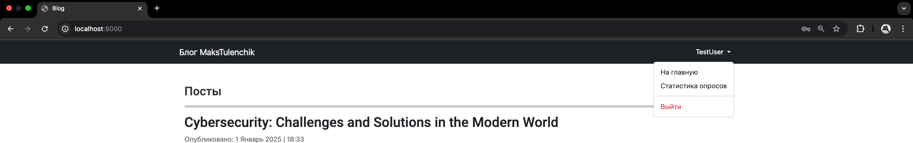
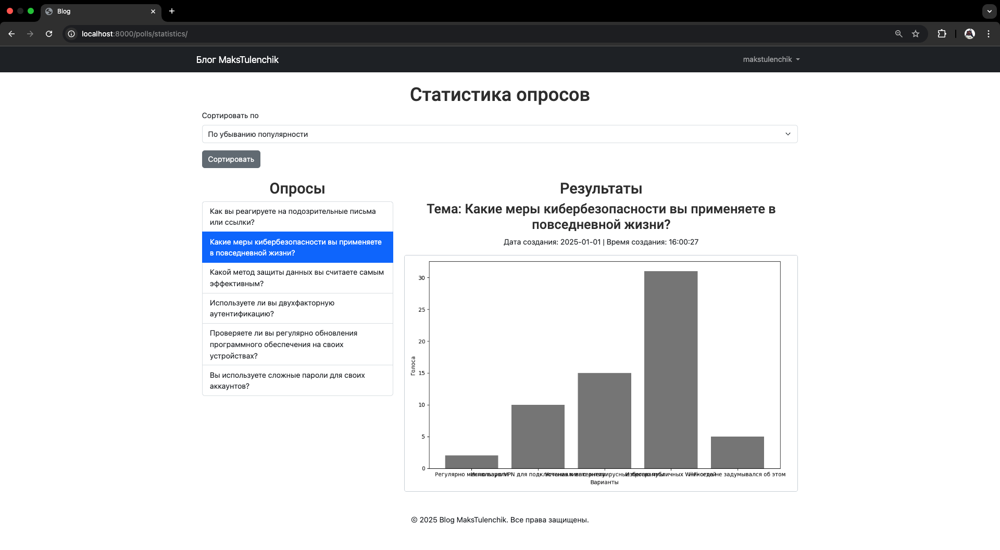
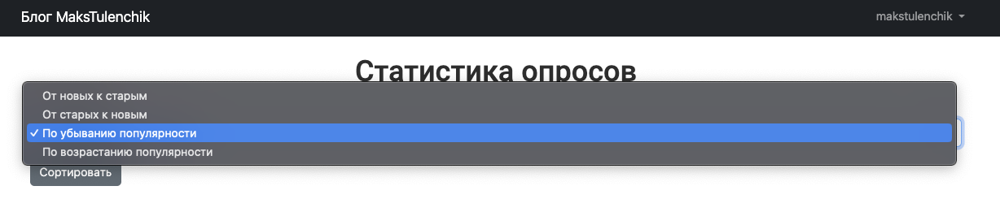
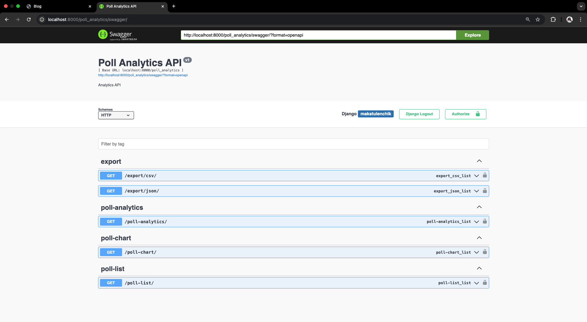
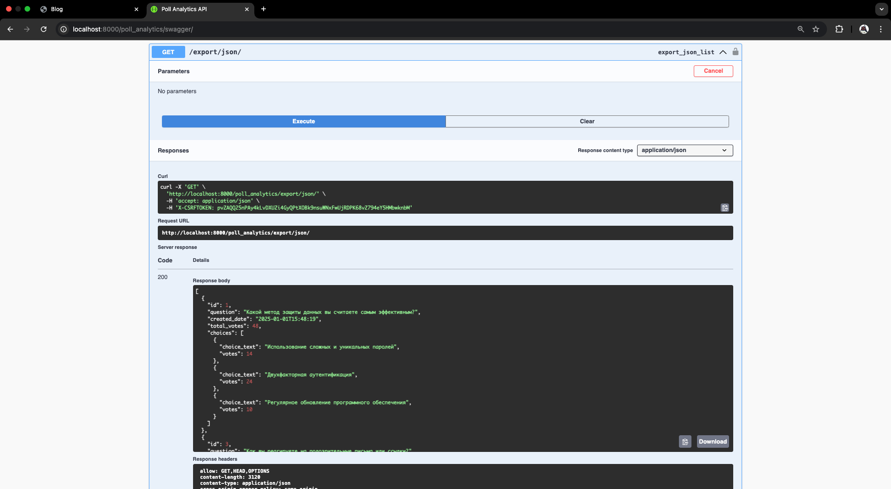
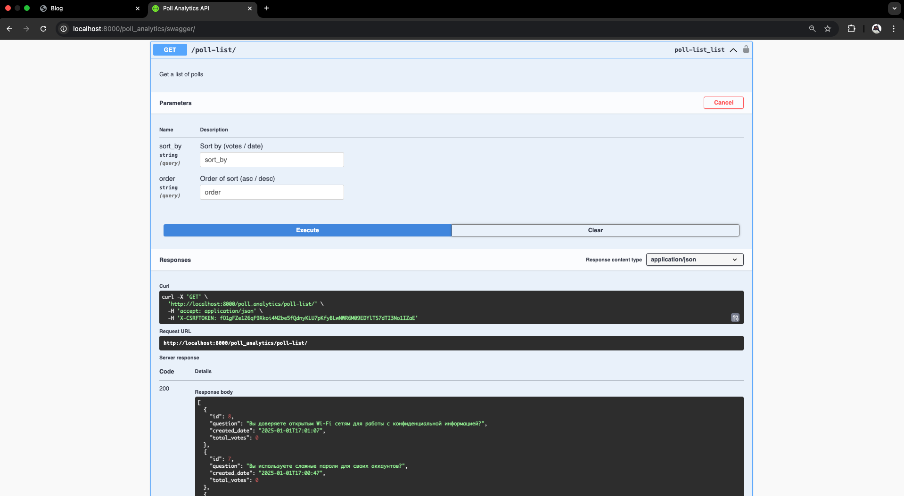
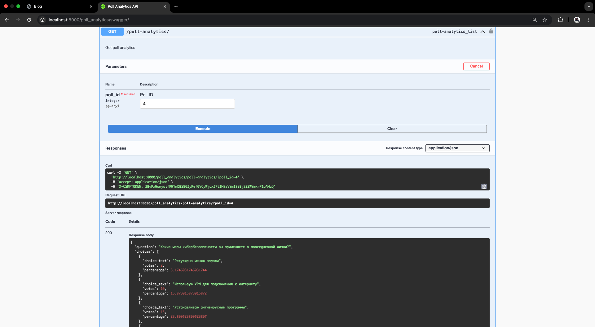

# Django

#### _Автор: Стецук Максим 1гр.2п.гр._

#### Выполненные задания:
- [Лабораторная работа 3 | "Введение в Django"](#лабораторная-работа-3--введение-в-django)
- [Лабораторная работа 4 | "Применение форм в Django"](#лабораторная-работа-4--применение-форм-в-django)
- [Практическая работа | "Настройка OAuth 2.0 авторизации в Django приложении"](#практическая-работа--настройка-oauth-20-авторизации-в-django-приложении)
- [Лабораторная работа 5 | "Django REST Framework"](#лабораторная-работа-5--django-rest-framework)

---

## Лабораторная работа 3 | Введение в Django

#### Пример главной страницы и меню

#### Пример детального просмотра поста

#### Пример редактирования поста

## Лабораторная работа 4 | Применение форм в Django

#### Пример главной страницы для неавторизованного пользователя

#### Пример страницы регистрации

#### Пример страницы авторизации

#### Премер главной страницы для авторизованного пользователя

#### Пример создания суперпользователя (администратора)

#### Пример окна авторизации в панели администрирования

#### Пример главной страницы для суперпользователя (администратора)

#### Пример страницы опроса для суперпользователя (администратора)

#### Пример страницы с результатами опроса для суперпользователя (администратора)

#### Пример страницы опроса для авторизованного пользователя (наблюдателя без прав редактирования)

#### Пример страницы с результатами опроса для авторизованного пользователя (наблюдателя без прав редактирования)

## Практическая работа | Настройка OAuth 2.0 авторизации в Django приложении
> **Примечание**
> Развертывание проекта выполнялось на localhost, вследвствие чего Google Console блокировала запросы от моего приложения :(

#### Пример страницы авторизации с добавленным вариантом авторизации через Google

#### Пример ошибки запроса в Google

## Лабораторная работа 5 | Django REST Framework

#### Пример доступности страницы статистики по голосованиям для неавторизованного пользователя

#### Пример доступности страницы статистики по голосованиям для авторизованного пользователя

#### Пример статистики по конкретному опросу

#### Пример реализованной сортировки опросов

#### Пример документации к микросервисам

#### Пример ручки для экспорта в JSON

#### Пример ручки для получения списка голосований

#### Пример ручки для получения статистики по конкретному опросу

