# RESTful web-app | Spring Boot

#### _Автор: Стецук Максим 1гр.2п.гр._

> _В файле `SpringBootH2Test` представлена конфигурация для `Bruno`, которая использовалась при тестировании_

---

### Пример успешного запуска прилоожения через IntelliJ IDEA
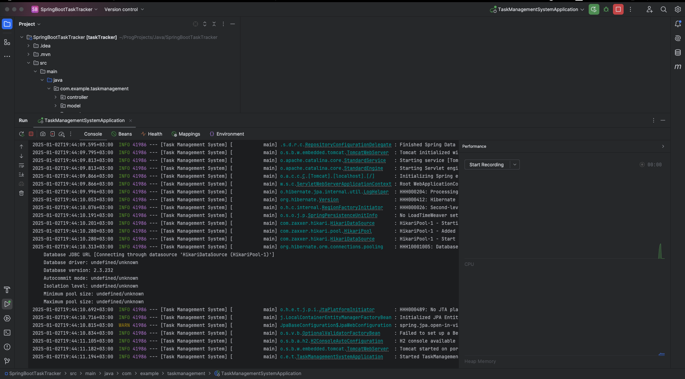

### Пример страницы авторизации в консоли h2
> _Адрес: `http://localhost:8080/h2-console`_

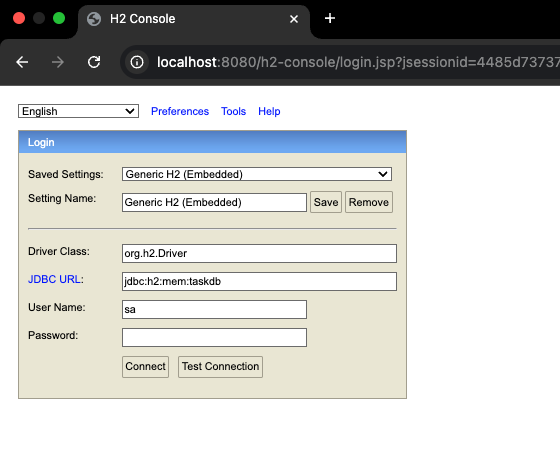

### Пример пустой таблицы Task
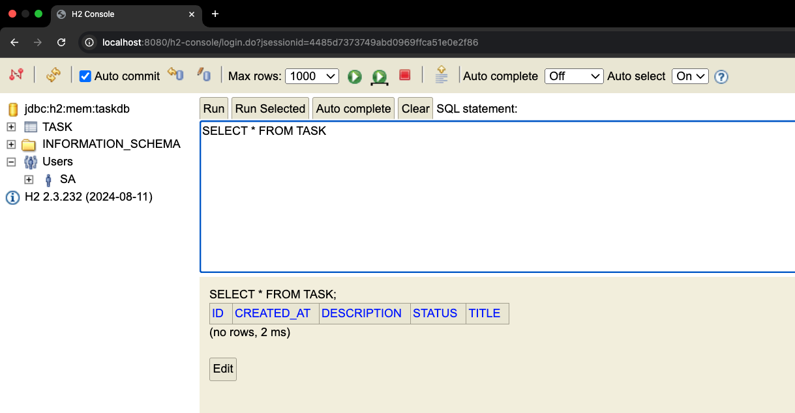

### Пример создания новой задачи
> _Создание новой задачи_

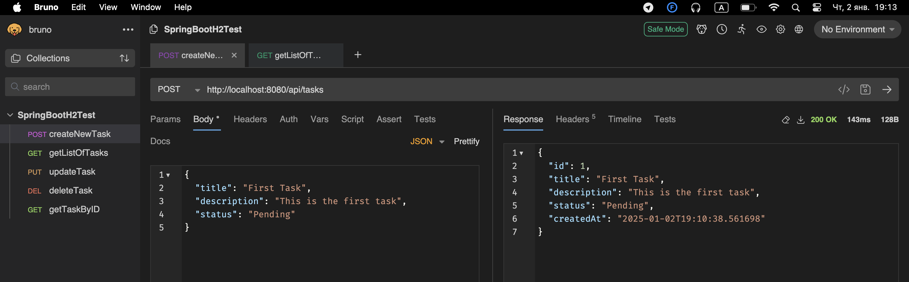

> _Корректное отображение созданной задачи в консоли_

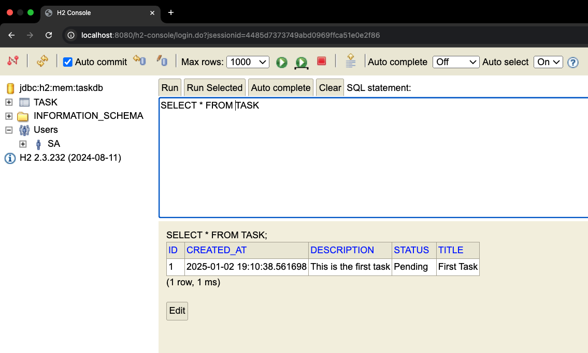

### Пример получения списка задач
> _Получение списка задач_

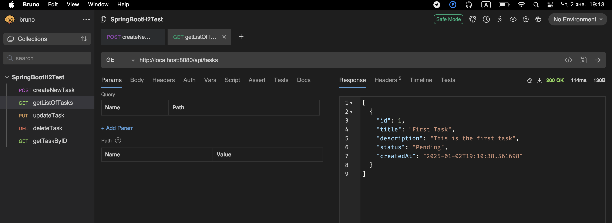

### Пример создания второй задачи
> _Создание второй задачи_

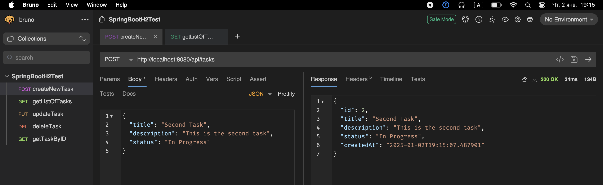

> _Корректное отображение двух задач в консоли_

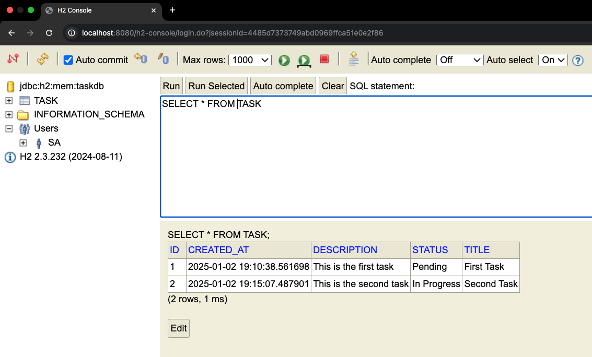

### Пример обновления существующей задачи
> _Обновление существующей задачи_

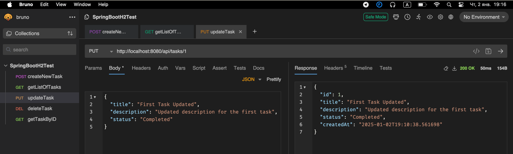

> _Корректное отображение обновленной задачи в консоли_

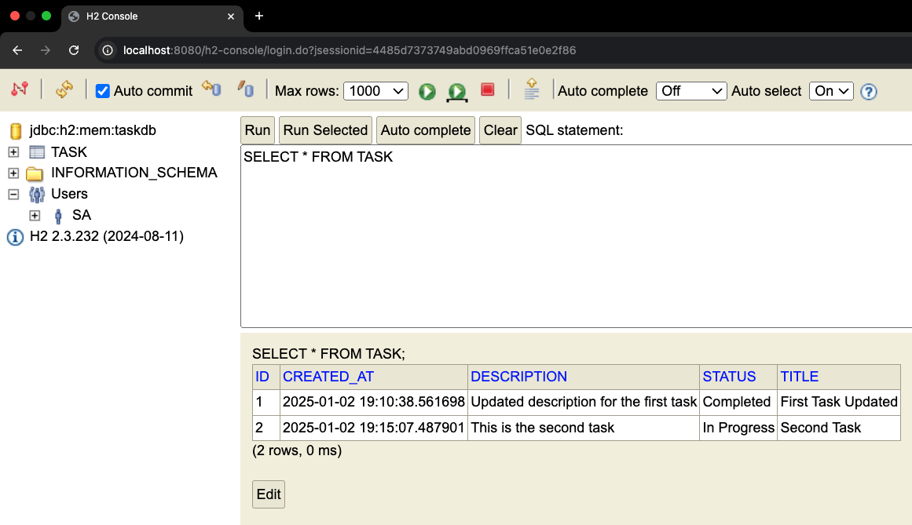

### Пример удаления задачи
> _Удаление задачи_

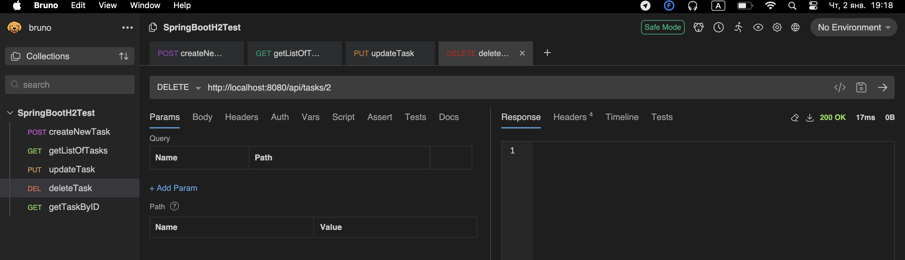

> _Корректное отображение списка задач без удаленной в консоли_

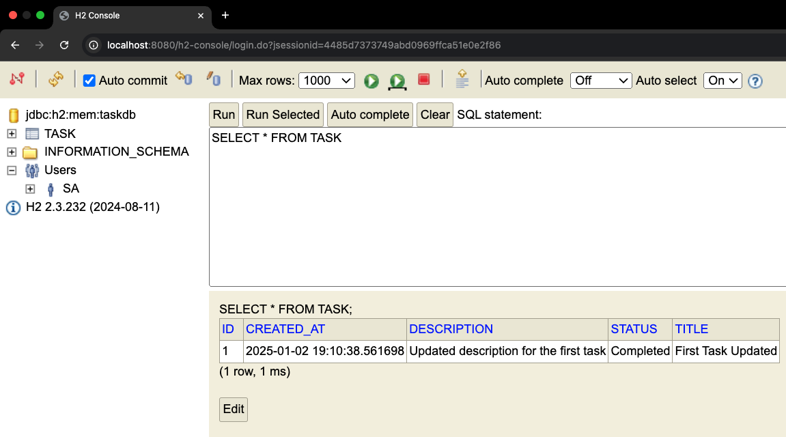

> _Получение списка задач без удаленной_

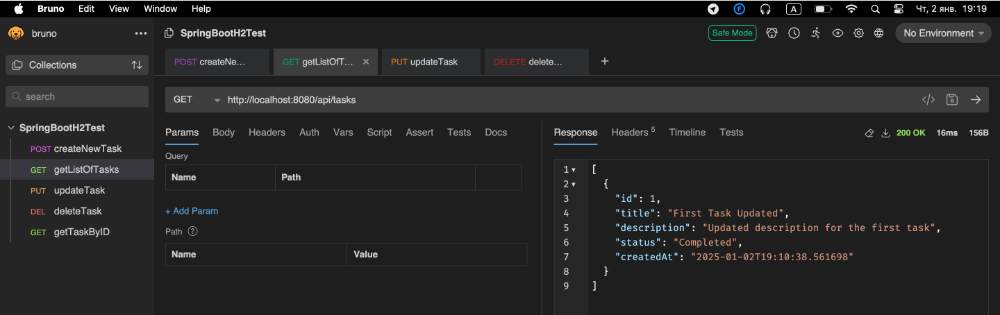

### Пример списка задач для проверки получения задачи по ID
> _Пример полученного списка задач_

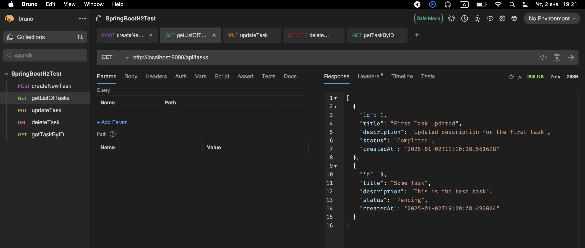

> _Пример списка задач в консоли_

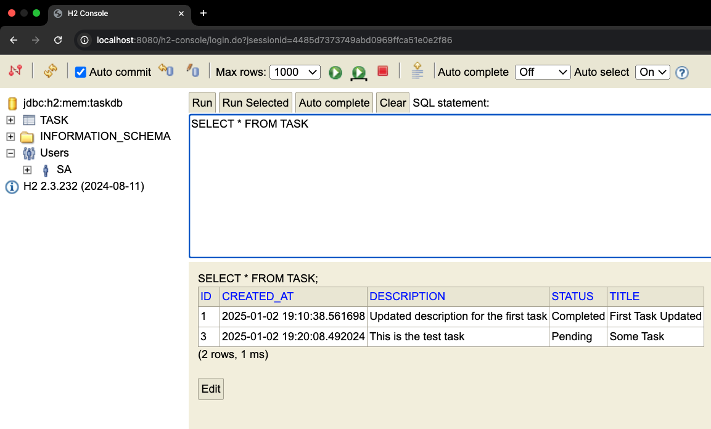

#### Пример получения задачи на ID

> Получение существующей задачи с `id=3`

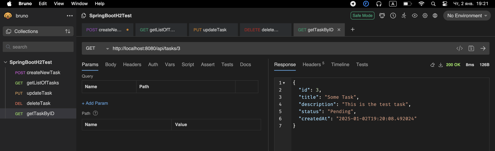

> Получение существующей задачи с `id=1`

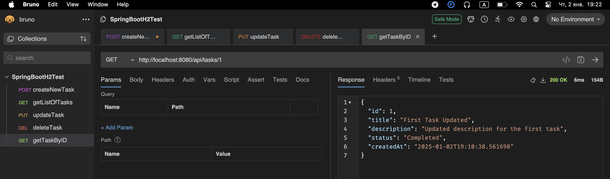

> Получение НЕсуществующей задачи с `id=2`

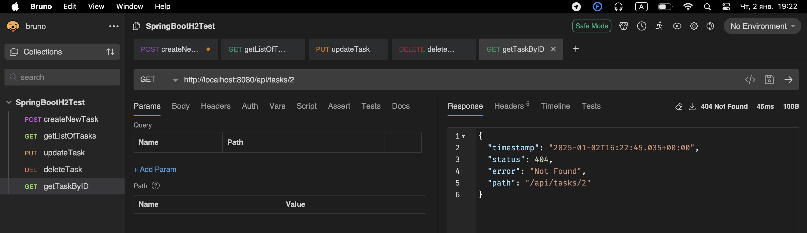
