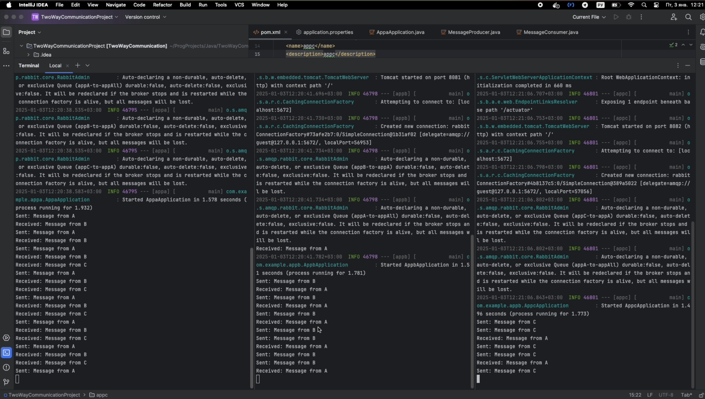

# Direct two-way communication between microservices on RabbitMQ | SpringBoot

#### _Автор: Стецук Максим 1гр.2п.гр._

#### Как запустить:
- Запуск Docker:
```bash
docker run -d --hostname rabbitmq --name rabbitmq -p 5672:5672 -p 15672:15672 rabbitmq:3-management
```
- Сборка приложений (`.jar` файлов):
```bash
mvn clean install
```
- Отдельный запуск приложений:
```bash
java -jar target/<snapshot_name>.jar
```

> #### Основная логика обмена сообщениями между приложениями:
> 
> Приложение A умеет отправлять сообщения приложениям B и C через общую очередь:  
> - если в текущий момент запущено только одно приложение из B и C, то все сообщения от A будут приходить к нему
> - если в текущий момент запущены и B и C, то вследствии использования общей очереди отправки сообщений от A, сообщения будут поочередно отправляться к B и C
> - если были запущены и B и C, а затем одно из них было отключено, то все сообщения из A будут отправляться в оставшееся включенное приложение
> 
> Приложения B и C отправляют сообщения в A через отдельные очереди, поэтому в данном случае все их сообзения доходят до приложения A, если оно запущено

---

### Видео с демонстрацией успешного обмена сообщениями между микросервисами
> Для перехода к видео тапните по изображению

[](https://disk.yandex.ru/i/DtzIsXkka64-zg)

