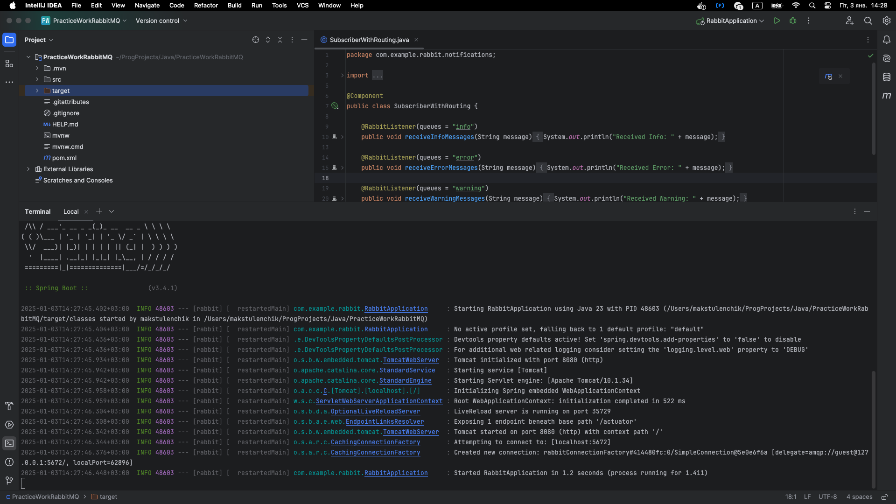
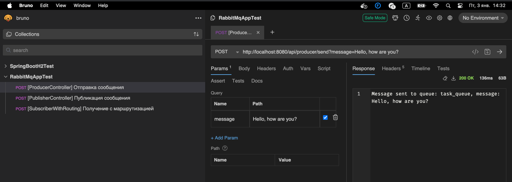
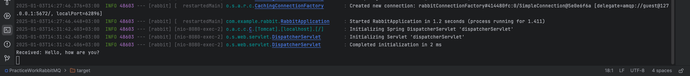
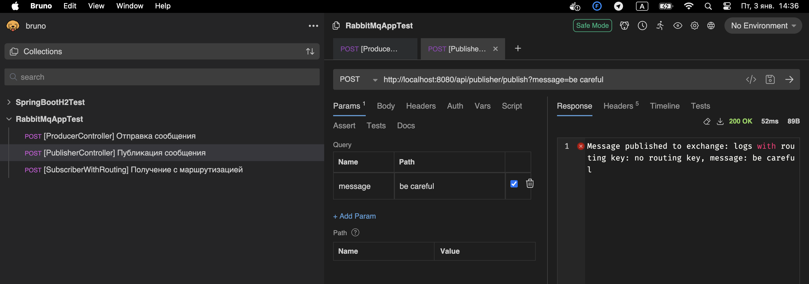
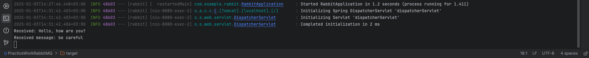
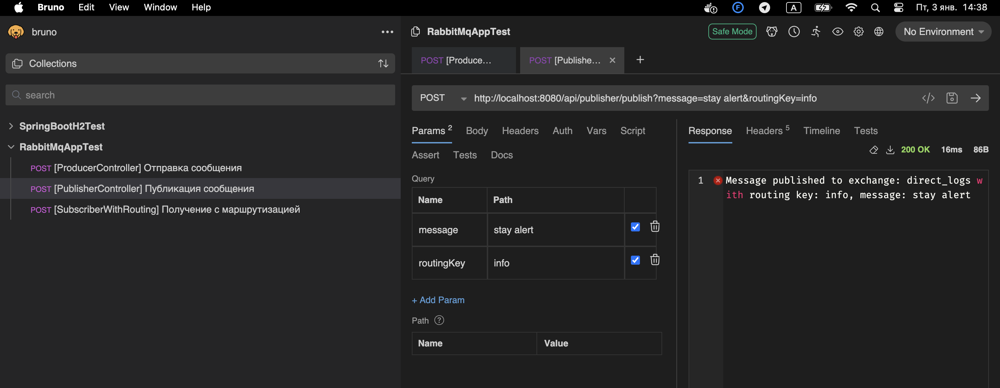
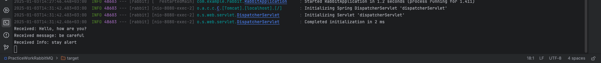
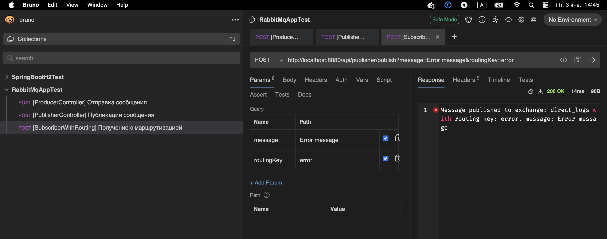
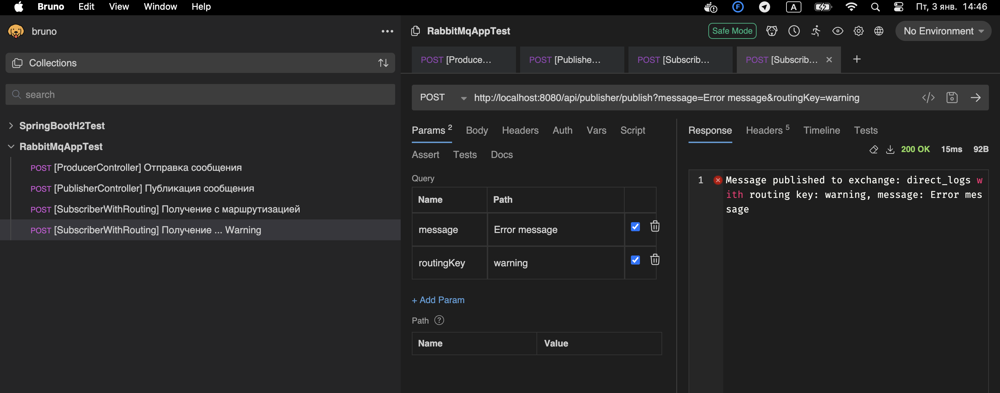
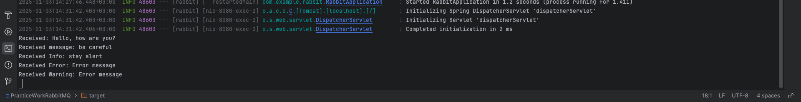

# Practice work | RabbitMQ

#### _Автор: Стецук Максим 1гр.2п.гр._

> _В файле `RabbitMQAppTest` представлена конфигурация для `Bruno`, которая использовалась при тестировании_

---

### Пример успешного запуска приложения через IntelliJ IDEA

### Пример успешной отправки ссобщения через `ProducerController`
> Отправка через Bruno

> Успешный вывод в консоль

### Пример сообщения через `PublisherController`
> Отправка через Bruno, без `routingKey`

> Успешный вывод в консоль

> Отправка через Bruno, с `routingKey = info`

> Успешный вывод в консоль

### Пример отправки с оставшимися ключами маршрутизации
> Отправка через Bruno, с `routingKey = error`

> Отправка через Bruno, с `routingKey = warning`

> Успешный вывод в консоль

