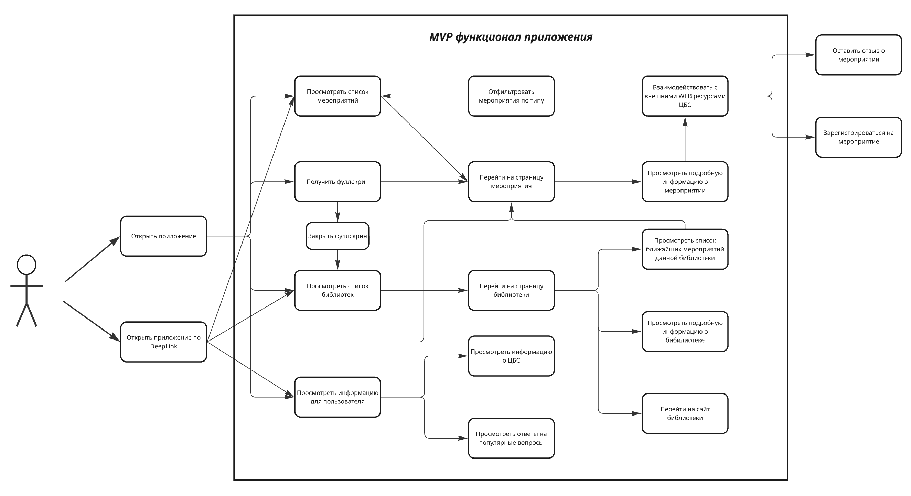
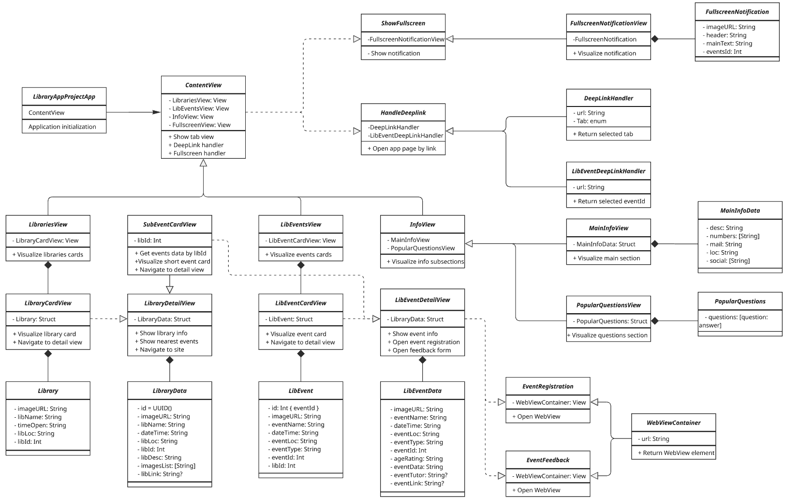
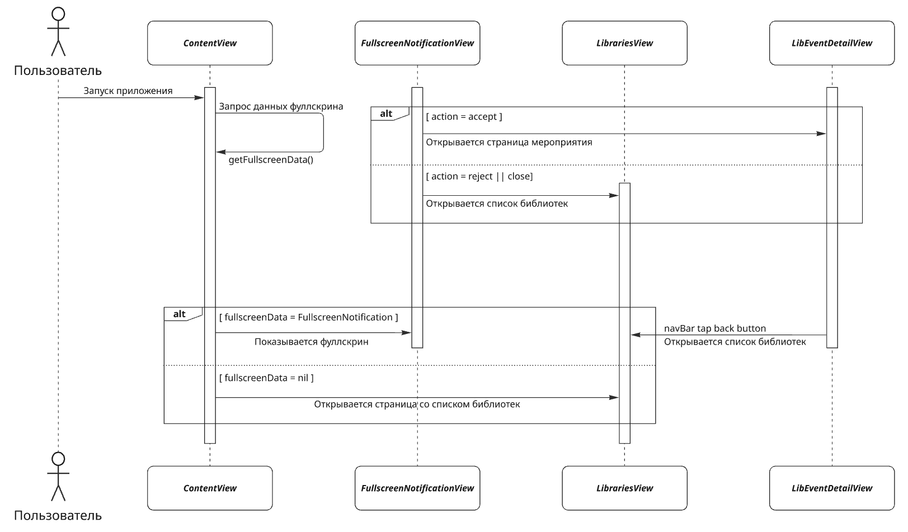
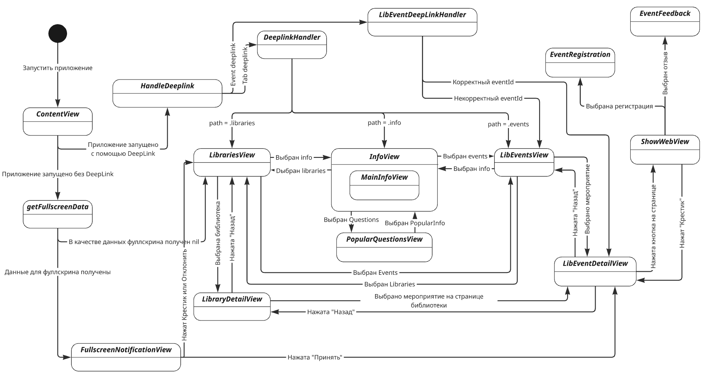
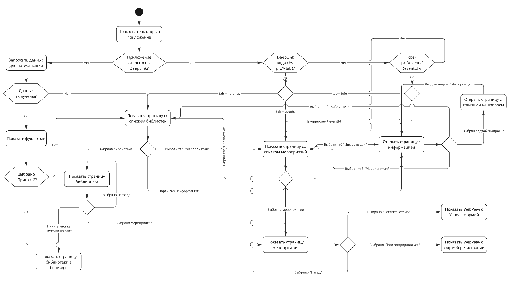
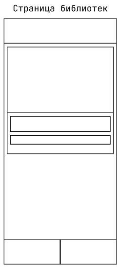
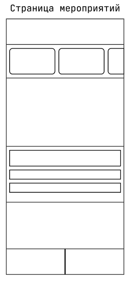
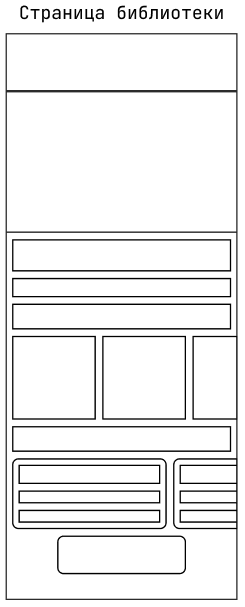
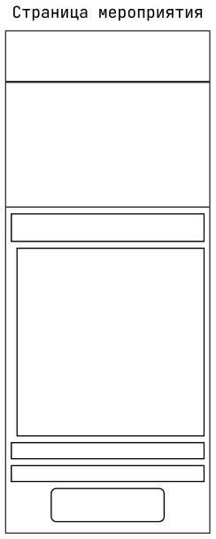
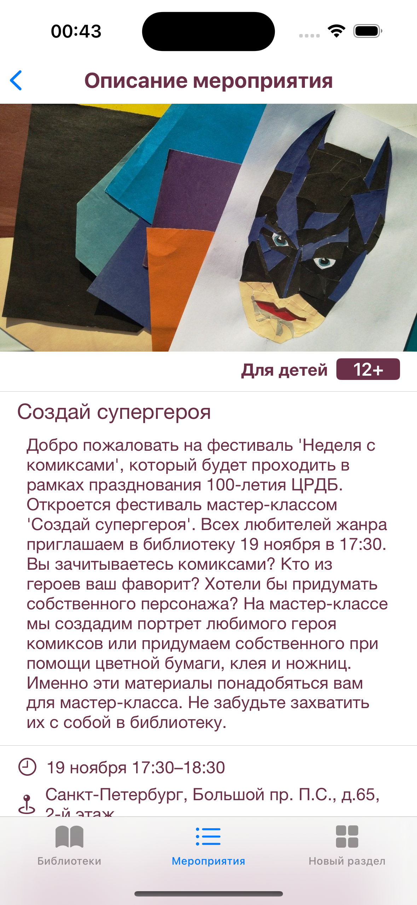

# Диаграммы для ВКР по теме: «Разработка UI iOS-приложения на омнове SwiftUI»

_В данном документе представлены UML диаграммы, описывающие логику работы разрабатываемого мной приложения в рамках работы над ВКР, а также прототипы интерфейса приложения_

### Ссылки:

- [Доска Miro с представленными в данном файле диаграммами](https://miro.com/app/board/uXjVIJIjapQ=/?share_link_id=631588641780)
- [Репозиторий с кодом приложения](https://github.com/XtulenchikX/LibraryAppProject)
- [Figma с макетами приложения](https://www.figma.com/design/PmdN4rQqXPbux2cI6TELkV/LibraryAppProject?node-id=0-1&t=2iSWgtEwaFzXPsye-1)

### Общее примечание:

_Данное примечание необходимо, чтобы дать объяснить причину использования большого количества классов и структур, отображенных на диаграмме классов_

Приложение разрабатывается в соответствии с принципами SOLID, рассмотрим 2 основных из них:

- `Single Responsibility Principle` - не допускает возможности одному классу делать большое количество действий (в рамках разработки iOS приложений `ContentView` является исключением, так как может восприниматься как файл конфигурации, который являетс параметром для инициализации всего приложения), таким образом каждый класс в моем проекте отвечает за несколько простых функций;

- `Open/Closed Principle` - код должен быть открыт для расширения, но закрыт для модификации. Соблюдение данного принципа позволяет добавлять новый функционал в приложение, при этом не затрагивая старый, либо внося минимальные правки, что так же объясняет большое количество взаимодействующих классов.

---
## 1. Use-case diagram

## 2. Classes diagram

## 3. Sequence diagram (for fullscreen handling)

## 4. State diagram

## 5. Activity diagram

---
## Прототипы интерфейса (+скрины реализации)

### 1. LibrariesView _(Таб со списком библиотек)_

    
    

### 2. LibEventsView _(Таб со списком мероприятий)_

    
    

### 3. LibraryDetailView _(Страница конкретной библиотеки)_

    
    

### 4. LibEventDetailView _(Страница конкретного мероприятия)_

    
    

